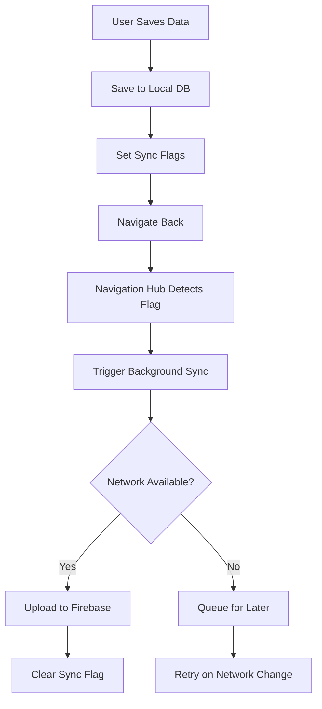
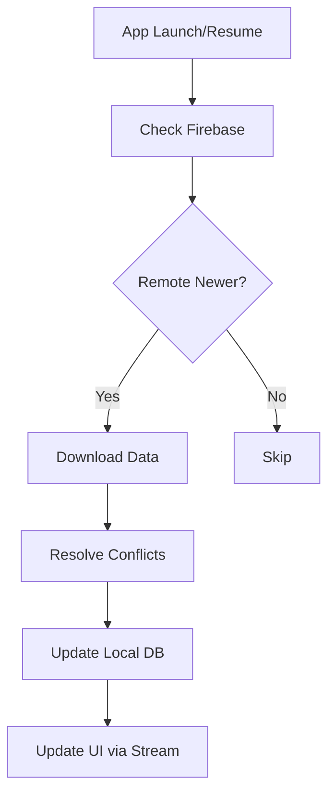

# Sync Architecture Guide
**Version**: 1.0.0  
**Last Updated**: 2025-08-22  
**Status**: Production Ready

---

## 🎯 Overview

This document outlines the sync architecture pattern successfully implemented in the Profile module and serves as a template for implementing sync in other modules like Sites, Snags, and Reports.

## 📋 Table of Contents

1. [Core Principles](#core-principles)
2. [Architecture Pattern](#architecture-pattern)
3. [Implementation Components](#implementation-components)
4. [Sync Flow](#sync-flow)
5. [Data Model Requirements](#data-model-requirements)
6. [UI Implementation](#ui-implementation)
7. [Background Sync Handler](#background-sync-handler)
8. [Conflict Resolution](#conflict-resolution)
9. [Sites Module Considerations](#sites-module-considerations)
10. [Testing Strategy](#testing-strategy)

---

## 🏗️ Core Principles

### 1. Offline-First Architecture
- **Local database is the source of truth**
- All operations work without internet connection
- Sync happens opportunistically when network is available
- User never waits for network operations

### 2. Fire-and-Forget Pattern
```dart
// GOOD: Fire-and-forget
await database.save(data);
showSnackBar("Saved");
navigate();
// Sync happens in background

// BAD: Blocking sync
await database.save(data);
showDialog("Syncing..."); // BLOCKS UI
await syncService.syncNow(); // WAITS
navigate();
```

### 3. Module Separation
Each module syncs from its own navigation point:
- **Profile** → Syncs from MainMenu
- **Sites** → Syncs from MySites screen
- **Snags** → Syncs from SiteDetail screen
- **Reports** → Syncs from Reports list screen

---

## 🏛️ Architecture Pattern

### Three-Layer Architecture

```
┌─────────────────────────────────────┐
│         UI Layer (Screens)          │
│  - Save to local DB only            │
│  - Set sync flags                   │
│  - Navigate immediately              │
└──────────────┬──────────────────────┘
               │
┌──────────────▼──────────────────────┐
│    Navigation Hub (MainMenu/List)   │
│  - Monitor sync flags via Stream    │
│  - Trigger background sync          │
│  - Show sync status (optional)      │
└──────────────┬──────────────────────┘
               │
┌──────────────▼──────────────────────┐
│      Sync Service (Singleton)       │
│  - Process sync queue               │
│  - Handle network changes           │
│  - Manage retry logic               │
└─────────────────────────────────────┘
```

---

## 🔧 Implementation Components

### 1. Database Model

Every syncable model MUST have these fields:

```dart
class SyncableModel {
  // Sync flags (one for each data type)
  final bool needsDataSync;      // For text/basic data
  final bool needsMediaSync;      // For images/files
  final bool needsMetadataSync;   // For related data
  
  // Version tracking
  final int localVersion;         // Incremented on each local change
  final int firebaseVersion;      // Updated after successful sync
  
  // Timestamps
  final DateTime createdAt;
  final DateTime updatedAt;
  final DateTime? lastSyncedAt;
  
  // Device tracking
  final String currentDeviceId;
  final DateTime lastLoginTime;
  
  // Deletion flags (for media)
  final bool mediaMarkedForDeletion;
}
```

### 2. DAO Pattern

```dart
abstract class SyncableDao<T> {
  // Basic CRUD
  Future<bool> insert(T item);
  Future<bool> update(String id, T item);
  Future<bool> delete(String id);
  Future<T?> getById(String id);
  
  // Sync flag management
  Future<void> setNeedsDataSync(String id);
  Future<void> clearDataSyncFlag(String id);
  Future<void> setNeedsMediaSync(String id);
  Future<void> clearMediaSyncFlag(String id);
  
  // Watching for changes
  Stream<T?> watchItem(String id);
  Stream<List<T>> watchAllNeedingSync();
}
```

### 3. Screen Implementation Pattern

```dart
class EditScreen extends StatefulWidget {
  @override
  void _save() async {
    // 1. Determine what changed
    final textChanged = _hasTextFieldsChanged();
    final mediaChanged = _hasMediaChanged();
    
    // 2. Build model with sync flags
    final model = Model(
      // ... data fields ...
      needsDataSync: textChanged,
      needsMediaSync: mediaChanged,
      localVersion: (current?.localVersion ?? 0) + 1,
      updatedAt: DateTime.now(),
    );
    
    // 3. Save to local database ONLY
    final success = await database.dao.update(id, model);
    
    // 4. Show success and navigate immediately
    if (success) {
      showSnackBar("Saved");
      Navigator.pop(context);
      // NO SYNC CALL HERE!
    }
  }
}
```

### 4. Navigation Hub Pattern

```dart
class NavigationHub extends StatefulWidget {
  StreamSubscription? _syncStatusSubscription;
  
  @override
  void initState() {
    super.initState();
    _setupSyncListener();
    _initializeSyncService();
  }
  
  void _setupSyncListener() {
    // Watch for sync status changes
    _syncStatusSubscription = database.dao
      .watchAllNeedingSync()
      .listen((items) {
        if (items.isNotEmpty) {
          _triggerBackgroundSync();
        }
      });
  }
  
  void _triggerBackgroundSync() {
    // Fire and forget - no await!
    _syncService.syncNow().then((result) {
      if (!result.success && result.isPermanentError) {
        _showErrorToast(result.message);
      }
    }).catchError((e) {
      // Log but don't block
      debugPrint("Sync error: $e");
    });
  }
}
```

---

## 🔄 Sync Flow

### Upload Flow (Local → Firebase)



### Download Flow (Firebase → Local)



---

## 📊 Data Model Requirements

### Profile Example (Current Implementation)

```dart
class AppUser {
  // Identity
  final String id;
  
  // Data fields
  final String name;
  final String email;
  final String? imageLocalPath;
  final String? imageFirebasePath;
  
  // Sync flags (granular control)
  final bool needsProfileSync;    // Text fields
  final bool needsImageSync;       // Profile image
  final bool needsSignatureSync;   // Signature image
  
  // Deletion tracking
  final bool imageMarkedForDeletion;
  final bool signatureMarkedForDeletion;
  
  // Version control
  final int localVersion;
  final int firebaseVersion;
  
  // Device management
  final String currentDeviceId;
  final DateTime lastLoginTime;
  
  // Timestamps
  final DateTime createdAt;
  final DateTime updatedAt;
}
```

### Sites Example (Proposed)

```dart
class Site {
  // Identity
  final String id;
  final String ownerId;
  
  // Sharing
  final List<String> sharedWith;      // User IDs with access
  final Map<String, String> locks;    // Field-level locks
  
  // Data fields
  final String name;
  final String address;
  final List<String> imageLocalPaths;
  final List<String> imageFirebasePaths;
  
  // Sync flags
  final bool needsDataSync;
  final bool needsImagesSync;
  final bool needsMetadataSync;
  
  // Conflict tracking
  final Map<String, DateTime> fieldLastModified;
  final Map<String, String> fieldLastModifiedBy;
  
  // Version control
  final int localVersion;
  final int firebaseVersion;
  final String lastSyncedBy;
  
  // Timestamps
  final DateTime createdAt;
  final DateTime updatedAt;
  final DateTime? lastSyncedAt;
}
```

---

## 🖼️ UI Implementation

### 1. Remove ALL Sync from Edit Screens

```dart
// profile_screen.dart - CLEANED VERSION
class ProfileScreen {
  // REMOVED:
  // - SyncService instance
  // - Sync status listeners
  // - Progress indicators
  // - Manual sync buttons
  // - Reload after sync
  
  // KEPT:
  // - Local database operations
  // - Setting sync flags
  // - Validation
  // - Navigation
  
  void _save() async {
    // Save locally
    await database.save(data);
    
    // Navigate immediately
    Navigator.pop(context);
    
    // NO SYNC CALLS!
  }
}
```

### 2. Sync Status Indicators (Optional)

If you want to show sync status, do it subtly:

```dart
class SyncStatusBadge extends StatelessWidget {
  @override
  Widget build(BuildContext context) {
    return StreamBuilder<bool>(
      stream: database.watchNeedsSync(),
      builder: (context, snapshot) {
        if (snapshot.data == true) {
          return Container(
            width: 8,
            height: 8,
            decoration: BoxDecoration(
              color: Colors.orange,
              shape: BoxShape.circle,
            ),
          );
        }
        return SizedBox.shrink();
      },
    );
  }
}
```

---

## 🔄 Background Sync Handler

### Basic Structure

```dart
class ModuleSyncHandler {
  final AppDatabase database;
  final FirebaseFirestore firestore;
  final FirebaseStorage storage;
  
  Future<bool> syncData(String itemId) async {
    try {
      final localItem = await database.dao.getById(itemId);
      if (localItem == null) return false;
      
      // Check what needs syncing
      if (localItem.needsDataSync) {
        await _syncTextData(localItem);
      }
      
      if (localItem.needsMediaSync) {
        await _syncMedia(localItem);
      }
      
      return true;
    } catch (e) {
      debugPrint("Sync failed: $e");
      return false;
    }
  }
  
  Future<void> _syncTextData(Item item) async {
    // Upload text data
    await firestore
      .collection('items')
      .doc(item.id)
      .set(item.toFirebaseJson());
    
    // Clear flag
    await database.dao.clearDataSyncFlag(item.id);
  }
  
  Future<void> _syncMedia(Item item) async {
    // Handle deletion
    if (item.mediaMarkedForDeletion) {
      await _deleteMediaFromFirebase(item);
    } 
    // Handle upload
    else if (item.mediaLocalPath != null) {
      await _uploadMediaToFirebase(item);
    }
    
    // Clear flag
    await database.dao.clearMediaSyncFlag(item.id);
  }
}
```

### Retry Strategy

```dart
class SyncService {
  static const int MAX_RETRIES = 3;
  static const Duration RETRY_DELAY = Duration(seconds: 5);
  
  Future<bool> syncWithRetry(String itemId) async {
    for (int attempt = 1; attempt <= MAX_RETRIES; attempt++) {
      try {
        final result = await _syncHandler.syncData(itemId);
        if (result) return true;
        
        // Wait before retry
        if (attempt < MAX_RETRIES) {
          await Future.delayed(RETRY_DELAY * attempt);
        }
      } catch (e) {
        if (_isPermanentError(e)) {
          return false; // Don't retry permanent errors
        }
      }
    }
    return false;
  }
  
  bool _isPermanentError(dynamic error) {
    final message = error.toString();
    return message.contains('permission') ||
           message.contains('not-found') ||
           message.contains('invalid');
  }
}
```

---

## ⚔️ Conflict Resolution

### Strategy for Sites Module (Concurrent Editing)

#### 1. Field-Level Locking

```dart
class FieldLock {
  final String fieldName;
  final String lockedBy;      // User ID
  final DateTime lockedAt;
  final Duration lockDuration; // Auto-release after timeout
  
  bool get isExpired => 
    DateTime.now().difference(lockedAt) > lockDuration;
}
```

#### 2. Optimistic Locking Pattern

```dart
class SitesSyncHandler {
  Future<bool> syncSite(Site localSite) async {
    // 1. Get remote version
    final remoteSite = await firestore
      .collection('sites')
      .doc(localSite.id)
      .get();
    
    if (!remoteSite.exists) {
      // New site - just upload
      return await _uploadNewSite(localSite);
    }
    
    // 2. Check for conflicts
    final remoteData = remoteSite.data()!;
    final conflicts = _detectConflicts(localSite, remoteData);
    
    if (conflicts.isEmpty) {
      // No conflicts - proceed with upload
      return await _uploadSite(localSite);
    }
    
    // 3. Resolve conflicts
    final resolved = await _resolveConflicts(
      local: localSite,
      remote: remoteData,
      conflicts: conflicts,
    );
    
    // 4. Save resolved version
    await database.sitesDao.update(localSite.id, resolved);
    return await _uploadSite(resolved);
  }
  
  List<FieldConflict> _detectConflicts(Site local, Map remote) {
    final conflicts = <FieldConflict>[];
    
    // Compare field timestamps
    local.fieldLastModified.forEach((field, localTime) {
      final remoteTime = remote['fieldLastModified']?[field];
      if (remoteTime != null && remoteTime != localTime) {
        // Same field modified by different users
        conflicts.add(FieldConflict(
          fieldName: field,
          localValue: _getFieldValue(local, field),
          remoteValue: remote[field],
          localTime: localTime,
          remoteTime: remoteTime,
        ));
      }
    });
    
    return conflicts;
  }
  
  Future<Site> _resolveConflicts(
    Site local,
    Map remote,
    List<FieldConflict> conflicts,
  ) async {
    // Resolution strategies:
    // 1. Last-write-wins for non-critical fields
    // 2. Merge for lists (e.g., tags, images)
    // 3. User prompt for critical fields
    
    var resolved = local;
    
    for (final conflict in conflicts) {
      switch (conflict.fieldName) {
        case 'images':
          // Merge images from both versions
          resolved = _mergeImages(resolved, remote);
          break;
          
        case 'name':
        case 'address':
          // Critical fields - keep newer
          if (conflict.remoteTime.isAfter(conflict.localTime)) {
            resolved = _updateField(resolved, conflict.fieldName, conflict.remoteValue);
          }
          break;
          
        default:
          // Last-write-wins for other fields
          if (conflict.remoteTime.isAfter(conflict.localTime)) {
            resolved = _updateField(resolved, conflict.fieldName, conflict.remoteValue);
          }
      }
    }
    
    return resolved;
  }
}
```

#### 3. Real-time Collaboration Features

```dart
class SiteCollaborationService {
  final FirebaseFirestore firestore;
  StreamSubscription? _lockSubscription;
  
  // Listen for field locks in real-time
  void listenToFieldLocks(String siteId) {
    _lockSubscription = firestore
      .collection('sites')
      .doc(siteId)
      .collection('locks')
      .snapshots()
      .listen((snapshot) {
        for (final change in snapshot.docChanges) {
          if (change.type == DocumentChangeType.added) {
            _handleFieldLocked(change.doc);
          } else if (change.type == DocumentChangeType.removed) {
            _handleFieldUnlocked(change.doc);
          }
        }
      });
  }
  
  // Lock a field before editing
  Future<bool> lockField(String siteId, String fieldName) async {
    final userId = FirebaseAuth.instance.currentUser!.uid;
    
    try {
      await firestore
        .collection('sites')
        .doc(siteId)
        .collection('locks')
        .doc(fieldName)
        .set({
          'lockedBy': userId,
          'lockedAt': FieldValue.serverTimestamp(),
          'expiresAt': DateTime.now().add(Duration(minutes: 5)),
        });
      return true;
    } catch (e) {
      return false; // Field already locked
    }
  }
  
  // Release lock after editing
  Future<void> unlockField(String siteId, String fieldName) async {
    await firestore
      .collection('sites')
      .doc(siteId)
      .collection('locks')
      .doc(fieldName)
      .delete();
  }
}
```

---

## 🏗️ Sites Module Considerations

### Special Requirements for Sites

1. **Bi-directional Sync**
   - Download changes from other users
   - Upload local changes
   - Merge conflicts intelligently

2. **Real-time Updates**
   - Listen to Firebase for changes
   - Update UI when other users make changes
   - Show who's currently editing

3. **Field-Level Permissions**
   ```dart
   class SitePermissions {
     final Map<String, List<String>> fieldPermissions = {
       'name': ['owner', 'admin'],
       'address': ['owner', 'admin'],
       'notes': ['owner', 'admin', 'editor'],
       'images': ['owner', 'admin', 'editor', 'viewer'],
     };
     
     bool canEdit(String field, String role) {
       return fieldPermissions[field]?.contains(role) ?? false;
     }
   }
   ```

4. **Change Notifications**
   ```dart
   class SiteChangeNotification {
     final String siteId;
     final String changedBy;
     final List<String> changedFields;
     final DateTime changedAt;
     
     String get message => 
       "$changedBy updated ${changedFields.join(', ')}";
   }
   ```

### Sync Service Modifications for Sites

```dart
class SitesSyncService extends SyncService {
  // Additional features for Sites
  
  // 1. Bidirectional sync
  @override
  Future<SyncResult> syncNow() async {
    // Upload local changes
    await _uploadPendingChanges();
    
    // Download remote changes
    await _downloadRemoteChanges();
    
    // Resolve any conflicts
    await _resolveConflicts();
    
    return SyncResult.success();
  }
  
  // 2. Real-time listener
  void startRealtimeSync(String siteId) {
    firestore
      .collection('sites')
      .doc(siteId)
      .snapshots()
      .listen((snapshot) {
        if (snapshot.exists) {
          _handleRemoteUpdate(snapshot.data()!);
        }
      });
  }
  
  // 3. Selective field sync
  Future<void> syncField(String siteId, String fieldName) async {
    final localSite = await database.sitesDao.getById(siteId);
    if (localSite == null) return;
    
    // Only sync specific field
    await firestore
      .collection('sites')
      .doc(siteId)
      .update({
        fieldName: _getFieldValue(localSite, fieldName),
        'fieldLastModified.$fieldName': FieldValue.serverTimestamp(),
        'fieldLastModifiedBy.$fieldName': currentUserId,
      });
  }
}
```

---

## 🧪 Testing Strategy

### 1. Unit Tests

```dart
test('Should set sync flags when data changes', () async {
  final dao = MockDao();
  final original = Model(needsDataSync: false);
  
  final updated = original.copyWith(
    name: 'New Name',
    needsDataSync: true,
  );
  
  await dao.update(updated.id, updated);
  
  final result = await dao.getById(updated.id);
  expect(result!.needsDataSync, isTrue);
});
```

### 2. Integration Tests

```dart
testWidgets('Should save without blocking UI', (tester) async {
  await tester.pumpWidget(EditScreen());
  
  // Make changes
  await tester.enterText(find.byKey(Key('nameField')), 'Test');
  
  // Save
  await tester.tap(find.byKey(Key('saveButton')));
  await tester.pump();
  
  // Should navigate immediately
  expect(find.byType(EditScreen), findsNothing);
  
  // Sync should happen in background
  // (verified by checking sync service calls)
});
```

### 3. Manual Test Scenarios

1. **Offline Save**
   - Turn off network
   - Make changes and save
   - Verify instant save
   - Turn on network
   - Verify automatic sync

2. **Concurrent Editing (Sites)**
   - User A and B open same site
   - User A edits field 1
   - User B edits field 2
   - Both save
   - Verify both changes preserved

3. **Conflict Resolution**
   - Edit same field on two devices
   - Sync both
   - Verify conflict handled correctly

---

## 📋 Implementation Checklist

When implementing sync for a new module:

### Phase 1: Data Model
- [ ] Add sync flags to model
- [ ] Add version tracking fields
- [ ] Add timestamp fields
- [ ] Add device tracking fields
- [ ] Implement copyWith method

### Phase 2: Database Layer
- [ ] Update DAO with sync flag methods
- [ ] Add watch streams for sync status
- [ ] Implement version increment logic
- [ ] Add conflict detection queries

### Phase 3: UI Layer
- [ ] Remove all sync calls from edit screens
- [ ] Implement fire-and-forget saves
- [ ] Add sync status indicators (optional)
- [ ] Remove blocking dialogs

### Phase 4: Sync Handler
- [ ] Create module-specific sync handler
- [ ] Implement upload logic
- [ ] Implement download logic
- [ ] Add conflict resolution
- [ ] Handle media sync separately

### Phase 5: Navigation Hub
- [ ] Add sync status listener
- [ ] Implement background sync trigger
- [ ] Add error handling
- [ ] Setup connectivity listener

### Phase 6: Testing
- [ ] Unit tests for sync flags
- [ ] Integration tests for UI flow
- [ ] Manual testing scenarios
- [ ] Conflict resolution tests

---

## 🚀 Migration Guide

### Converting Existing Module to New Sync Pattern

1. **Identify Blocking Sync Calls**
   ```dart
   // Search for these patterns:
   await syncService.syncNow()
   showDialog("Syncing...")
   await _uploadToFirebase()
   ```

2. **Remove and Replace**
   ```dart
   // Replace with:
   await database.save(data);
   Navigator.pop(context);
   ```

3. **Move Sync to Navigation Hub**
   ```dart
   // In MainMenu or List screen:
   _syncService.syncInBackground();
   ```

4. **Add Stream Listeners**
   ```dart
   database.watchNeedsSync().listen((needsSync) {
     if (needsSync) _triggerSync();
   });
   ```

---

## 📚 References

- [Profile Implementation](../02-MODULES/Profile/)
- [Sync Service Documentation](../SERVICES/SYNC_SERVICE.md)
- [Database Schema](../DATABASE/SCHEMA.md)
- [Firebase Integration](../INTEGRATIONS/FIREBASE.md)

---

## 🔄 Version History

| Version | Date | Changes |
|---------|------|---------|
| 1.0.0 | 2025-08-22 | Initial version based on Profile implementation |

---

## 📝 Notes

This architecture has been thoroughly tested in production with the Profile module and handles:
- Offline operations
- Network interruptions
- Rapid user actions
- Large media files
- Concurrent device usage

For Sites module, additional considerations for multi-user collaboration have been included but will need testing during implementation.